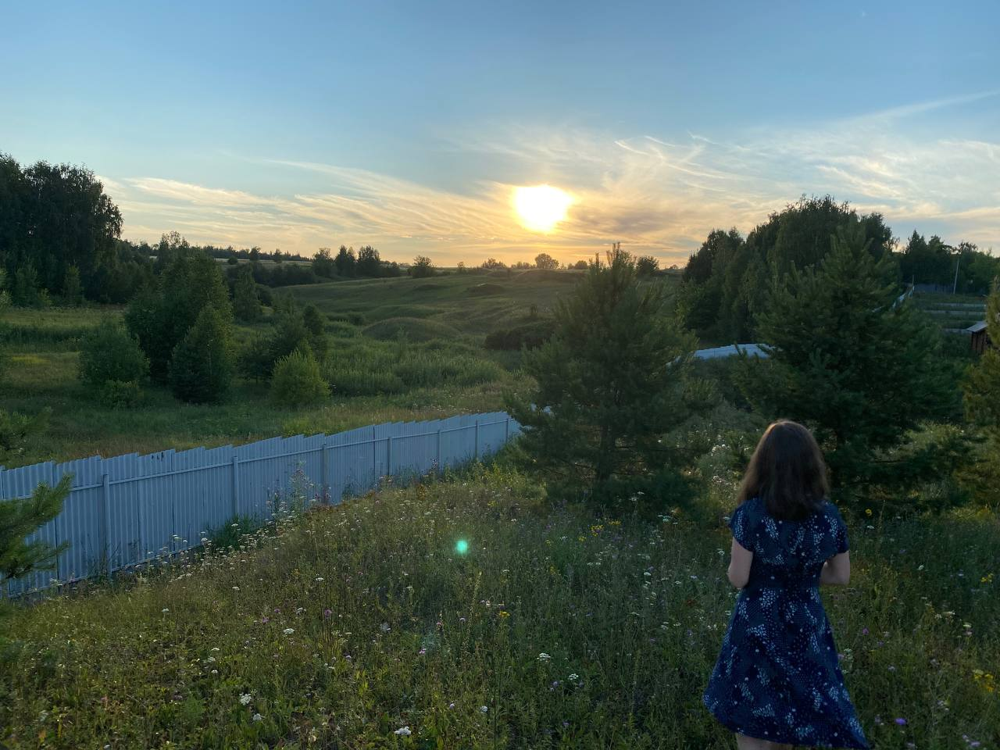
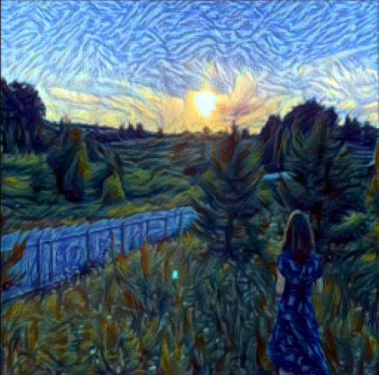
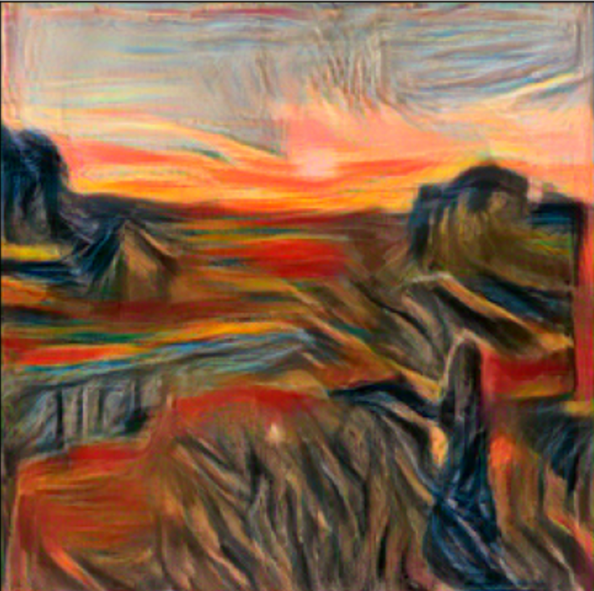

# Style transfer
Нейронная сеть принимает на вход 2 изображения:
* Исходное
* Изображение стиля, в котором хотим сделать исходное изображение (например, "Крик" Мунка)

На выходе получается исходная картинка в стиле второй картинки.

Пример: исходное изображение.

Изображение стиля:

Выходное:

Выходное, если картинка стиля "Крик" Мунка:

# Как запускать
Запускаем файл _style_transfer.py_

Если у вас GPU, то будет работать на CUDA, и можно ставить картинки большего качества. Дефолтные опции:

`imsize = 512 if torch.cuda.is_available() else 256`

То есть изображение ресайзится до _256x256x3_ на _CPU_, у меня на Маке с таким разрешением выходное изображение создается примерно за пару минут. Можно поставить еще меньше (128 или 64) для тестов.

### Модель основана на бэкбоне VGG19
Из нее берутся некоторые слои для расчета функции потерь стиля и потери "контента", здесь:

`content_layers_default = ['conv_6']`

`style_layers_default = ['conv_1', 'conv_2', 'conv_3', 'conv_4', 'conv_5']`

Это немного отличается от оригинальной имплементации, я поменял слои на более поздние, чтобы лучше вытащить признаки более высокого уровня. С этим можно поэксперементировать.

### Выходное изображение сохраняется там же, где лежат остальные картинки
Лучше добавить отдельную папку, но влом =)
